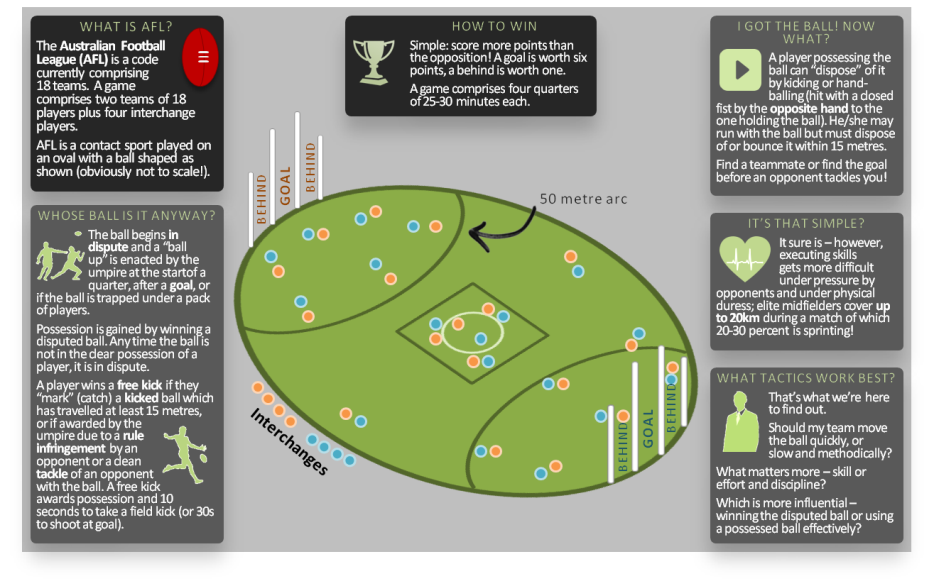

```{r setup, include=FALSE}
knitr::opts_chunk$set(echo = FALSE)
```

## Purpose & Objective
In AFL, as with any sport, teams are driven by one thing: Success. Success means winning, winning consistently, and winning premierships.

Here's a snippet of a game: [youtube.com/watch?v=QH188gSGnsk](https://www.youtube.com/watch?v=QH188gSGnsk)

This data driven analysis is intended to answer key questions for an AFL manager or coach. Should my team's training target skills, discipline or fitness? What sort of players am I seeking to recruit in the draft to maximise my chances of winning matches?

### Hypothesis
The core hypothesis of the analysis is that AFL player performance data recorded from competitive matches can be used to identify key success criteria and in turn predict match results.

## Background - what is AFL?
<div style="margin-left:-60px; margin-top:-45px;">
</img>
</div>

## Proposed capstone project
### The Question
My proposed data science project is to seek insights on what determines the result of an AFL match; that is, how players and team tactics influence win/loss results.

The client in this case is an AFL football team manager or coach who needs to set up his/her team's tactics before the start of the season, or needs to know how to select players in the annual player draft. Knowing how tactics and performance metrics influence results can inform these decisions and could potentially challenge "accepted wisdom" on how AFL games are played and won.

<div style="margin-left:0px; margin-top:10px;">
</img>
</div>


## Proposed capstone project (cont'd)
### Approach
The proposed analysis will require player performance metrics (as x variables) and team win/loss results (as y variable). Detailed player metrics are recorded by Champion Data on behalf of the AFL but are notoriously difficult to collect - see [afl.com.au/stats](http://www.afl.com.au/stats). Instead, both player metrics and team results can be either copied or scraped from [afltables.com](https://afltables.com), a site maintained by a game enthusiast. Here is one example of player metrics (one team, one season, round-by-round): [afltables.com/afl/stats/teams/geelong/2017_gbg.html](https://afltables.com/afl/stats/teams/geelong/2017_gbg.html). Here is one season's win/loss results (all teams, 2017, round-by-round): [afltables.com/afl/seas/2017.html](https://afltables.com/afl/seas/2017.html).

The raw metrics are unlikely to be informative; obviously, there will be a relationship between goals scored and wins, but I am assuming there will not be any significant relationships in the raw data otherwise. Therefore, I propose creation of _indices_ at team level which consider player metrics together; e.g. how efficient teams are when using the ball or how much effort they put in to win the ball. These indices can also be used to infer team tactics.

My final analysis will be shown in an R Markdown presentation expanding on this short proposal.