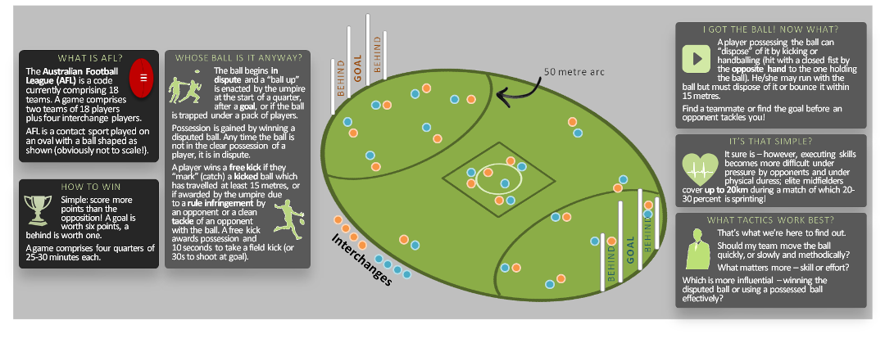

```{r setup, include=FALSE}
# EVAL TURNED OFF: exploreplot01, exploreplot02, exploreplot03, exploreplot04, exploreplot11, exploreplot12, exploreplot13, exploreplot14, exploreplot15, exploreplot16a, select03

knitr::opts_chunk$set(echo = FALSE)
# set working directory
  setwd("C:\\Users\\james.hooi\\Documents\\data analytics\\Springboard-FDS-Capstone")
# load required libraries
  library(dplyr)
  library(tidyr)
  library(ggplot2)
  library(reshape2)
  library(data.table)
  
  options(width=200)
  
  load(file=".\\player_metrics.Rda")
  load(file=".\\team_results.Rda")
```

## Sport is about *Winning*

Since the story of Moneyball and the Oakland A's became public, sport has begun a data-driven revolution. Elite sport is about winning and commercial success, and both are closely linked. Data analysis is giving teams the competitive edge in elite competition to "control the controllables" and tilt the game in their favour.

This analysis sets out to link Australian Football League (AFL) player performance with team results. My core hypothesis is that these links can identify **how to win** matches and **predict match results** for a season.

## Purpose & Objective
**As coach, how can I build, select or train my AFL team to maximise success?** (game snippet: [youtube.com/watch?v=QH188gSGnsk](https://www.youtube.com/watch?v=QH188gSGnsk))
<div style="margin-left:-50px; margin-top:0px; margin-bottom:-60px">
</img>
</div>

## Data sources and key variables
Data on the most recent 15 AFL seasons have been wrangled into two data frames:

- Player metrics, forming the x variables to be aggregated at team level to explain and predict match results, and
- Team results, the y variable I am seeking to predict.

Detailed steps on scraping and wrangling can be found in this report: [rawgit.com/r3nault/Springboard-FDS-Capstone/master/fds-capstone-jameshooi-AFL-020-data-wrangling.html](https://rawgit.com/r3nault/Springboard-FDS-Capstone/master/fds-capstone-jameshooi-AFL-020-data-wrangling.html). I have loaded the libraries **dplyr**, **tidyr**, **data.table**, **ggplot2** and **reshape2** to R.

```{r sourcedata, eval=TRUE, echo=TRUE, warning=FALSE}
  head(data.frame(player.metrics), 5)
  head(data.frame(team.results))
```


<!-- ## Functions for base exploratory analysis -->
<!-- To explore range, median and interquartile range of player metrics, the following functions are defined: -->

```{r plotfns, eval=TRUE, echo=FALSE, warning=FALSE}
  pos.d = position_dodge(width = 0.35)
  
  # stat function to find range of plot
  plot_range = function(x){ data.frame(ymin = min(x), ymax = max(x)) }
  
  # stat function to find median and interquartile range of plot
  plot_med_IQR = function(x){ data.frame(y = median(x), ymin = quantile(x, probs=0.25), ymax = quantile(x, probs=0.75)) }
  
  # template line range plot, dummy variable for x, parameter for y, split out wins/losses and facet by year
  plot_linerange_by_year = function(in_df, yvar, plot_title, plot_caption){
    ggp = ggplot(in_df, aes_string(x=1, y=yvar, col="team_result")) +
      stat_summary(geom = "linerange", fun.data = plot_med_IQR, position = pos.d, size = 0.8, alpha = 0.6) +
      stat_summary(geom = "linerange", fun.data = plot_range, position = pos.d, size = 0.8, alpha = 0.3) +
      scale_colour_manual(labels = c("Loss or draw","Win"), values = c("red","blue")) +
      stat_summary(geom = "point", fun.y = median, position = pos.d, size = 1.1, shape = 15, alpha = 0.9) +
      facet_grid(. ~ Year) +
      labs(title = plot_title, color = "Result", caption = plot_caption) +
      theme(axis.title.x = element_blank(), axis.ticks.x = element_blank(), axis.text.x = element_blank()
            , axis.title.y = element_blank(), axis.text.y = element_text(size = 6), legend.position = "none"
            , strip.text.x = element_text(size = 6.5, angle = 90)
            , plot.title = element_text(size = 8), plot.caption = element_text(size = 7))
    print(ggp)
  }
```

## Exploratory plots - data preparation
Prepare data by player showing match result:

```{r dataprep1, eval=TRUE, echo=TRUE, warning=FALSE}
  AFL.by.player = merge(player.metrics, team.results, by.x = c("Year","round","Team"), by.y = c("Year","round","Team")) %>% 
  select(-score_str, -rownum, -(Q1score_cumul:ETscore)) %>% 
  mutate(team_result = as.factor(if_else(team_result == "win", 1, 0)),
         Q1_win = as.factor(Q1_win), Q2_win = as.factor(Q2_win), Q3_win = as.factor(Q3_win), Q4_win = as.factor(Q4_win),
         ET_win = as.factor(ET_win), match_score_idx = final_score/(final_score - final_margin)) %>% 
  select(-final_score, -final_margin)
  head(AFL.by.player, 3)
```

Aggregate player data by team showing match result:

```{r dataprep2, eval=TRUE, echo=TRUE, warning=FALSE}
  AFL.by.team = AFL.by.player %>% 
  group_by(Year, round, Team, home_away, match_id, vs_opponent, team_result, Q1_win, Q2_win, Q3_win, Q4_win, ET_win, match_score_idx) %>% 
  select(-Player, -Played_pct) %>% summarise_all(funs(sum)) %>% ungroup
  head(AFL.by.team, 3)
```

## Exploratory plots - base metrics (pg.1 of 3)
Metrics by year, showing median, IQR and range (Red/LHS = loss or draw, Blue/RHS = win):

```{r exploreplot01, eval=TRUE, echo=FALSE, warning=FALSE, fig.height=2.4, fig.width=2.55}
  plot_linerange_by_year(AFL.by.team, "Behinds","Behinds (1 point)", "65.9% confident win/loss difference positive")
  plot_linerange_by_year(AFL.by.team, "Bounces","Running Bounces", "57.1% confident win/loss difference positive")
  plot_linerange_by_year(AFL.by.team, "Clangers","Clangers (errors)", "58.7% confident win/loss difference negative")
  plot_linerange_by_year(AFL.by.team, "Clearances","Clearances (disputed ball to advantage)", "59.9% confident win/loss difference positive")
  plot_linerange_by_year(AFL.by.team, "Contested_marks","Contested marks (catch vs opponents)", "62.2% confident win/loss difference positive")
  plot_linerange_by_year(AFL.by.team, "Contested_possessions","Contested possessions (gather-dispose)", "62.9% confident win/loss difference positive")
  plot_linerange_by_year(AFL.by.team, "Disposals","Disposals (handball or kick)", "69.9% confident win/loss difference positive")
  plot_linerange_by_year(AFL.by.team, "Frees","Free kicks awarded", "52.4% confident win/loss difference positive")
```

## Exploratory plots - base metrics (pg.2 of 3)
Metrics by year, showing median, IQR and range (Red/LHS = loss or draw, Blue/RHS = win):

```{r exploreplot02, eval=TRUE, echo=FALSE, warning=FALSE, fig.height=2.4, fig.width=2.55}
  plot_linerange_by_year(AFL.by.team, "Frees_against","Free kicks given away", "52.0% confident win/loss difference negative")
  plot_linerange_by_year(AFL.by.team, "Goal_assists","Goal assists", "81.3% confident win/loss difference positive")
  plot_linerange_by_year(AFL.by.team, "Goals","Goals (6 points)","87.1% confident win/loss difference positive")
  plot_linerange_by_year(AFL.by.team, "Handballs","Handballs", "57.5% confident win/loss difference positive")
  plot_linerange_by_year(AFL.by.team, "Hit_outs","Hit-outs (win ball-up tap)", "53.6% confident win/loss difference positive")
  plot_linerange_by_year(AFL.by.team, "Inside_50s","Inside 50s (ball enters 50m arc)", "77.9% confident win/loss difference positive")
  plot_linerange_by_year(AFL.by.team, "Kicks","Kicks", "79.1% confident win/loss difference positive")
  plot_linerange_by_year(AFL.by.team, "Marks","Marks (catches)", "68.1% confident win/loss difference positive")
```

## Exploratory plots - base metrics (pg.3 of 3)
Metrics by year, showing median, IQR and range (Red/LHS = loss or draw, Blue/RHS = win):

```{r exploreplot03, eval=TRUE, echo=FALSE, warning=FALSE, fig.height=2.4, fig.width=2.55}
  plot_linerange_by_year(AFL.by.team, "Marks_inside_50","Marks inside 50 (catch inside 50m arc)","76.1% confident win/loss difference positive")
  plot_linerange_by_year(AFL.by.team, "One_pct","1 percenters (exceptional effort)", "53.2% confident win/loss difference positive")
  plot_linerange_by_year(AFL.by.team, "Tackles","Tackles", "53.6% confident win/loss difference positive")
  plot_linerange_by_year(AFL.by.team, "Uncontested_possessions","Uncontested possessions (receive-dispose)", "65.9% confident win/loss difference positive")
```

### Insights from base metrics are very limited

Whilst the exploratory analysis highlights some relationships in team-aggregated player metrics, these do not generate usable insights for an AFL team manager or coach. Applying basic game principles, the ability to win is predicated on scoring (measured by Behinds, Goal assists, Goals, Inside 50s, Marks inside 50) which in turn requires the team to possess the ball (measured by Clangers [negator], Disposals, Kicks, Marks, Uncontested possessions). To possess the ball, the team must first win it (Clearances, Contested marks, Contested possessions).

Deeper insights are needed.


## Sport is adversarial

In analysing AFL team performance, it is important to remember the game is adversarial; i.e. player and team outcomes are impacted by the actions of opponents. This provides a vital lense to two key points: 1) the variability in a team's aggregated metrics due to changes in weather conditions etc can be ignored by performing comparisons with the opposing team (in theory, equally impacted by the same conditions), and 2) insight can only truly be gained by considering team metrics in an adversarial context rather than in isolation.

The below code brings in the opposing team's aggregated metrics for each match (some metrics removed as not used further):

```{r dataprep3, eval=TRUE, echo=TRUE, warning=FALSE, fig.height=2.4, fig.width=3.4}
# Match-wise (adversarial) view of results
  AFL.by.team.sub = AFL.by.team %>% select(-Disposals, -Frees, -Hit_outs)
  AFL.by.match = merge(AFL.by.team.sub, AFL.by.team.sub %>% rename (Team.opp = Team), 
                        by.x = c("Year","round","match_id","Team"), by.y = c("Year","round","match_id","vs_opponent"),
                        suffixes = c("",".opp")) %>% select(-vs_opponent) %>% arrange(match_id)

  head(AFL.by.match, 4)
```

## Sport is adversarial (cont'd)

Using some basic game knowledge, I created indices to compare team performance versus their match opposition. These were:

Description | Calculation
----------- | -----------
Win the ball in contested situations | $idx.win.ground.ball = \log(contested.possessions/Opp.contested.possessions)$
Mark the ball in contested situations | $idx.win.aerial.ball = \log(contested.marks/Opp.contested.marks)$
Win first use from scrimmage | $idx.clear.ball = \log(clearances/Opp.clearances)$
Make less errors than opposition | $idx.less.clangers = \log(Opp.clangers/clangers)$
Teamwork for goal | $idx.goal.assist = \log[(goal.assists/goals)/(Opp.goal.assists/Opp.goals)]$
Maintain clear possession | $idx.mark.kick = \log[(marks/kicks)/(Opp.marks/Opp.kicks)]$
Accurate 50m entries | $idx.50m.entry = \log[(marks.inside.50/inside.50s)/(Opp.marks.inside.50/Opp.inside.50s)]$
Work hard when not in possession | $idx.tackle = \log(tackles/Opp.tackles)$
Win one-percenters | $idx.one.pct = \log(one.pct/Opp.one.pct)$, and
Give away less penalties than opposition | $idx.less.frees = \log(Opp.frees.against/frees.against)$

Note: there were three pairs of 0:Inf in the data which were changed to 0.01:1 prior to applying log. Draws were filtered out.

```{r dataprep4, eval=TRUE, echo=FALSE, warning=FALSE}
# Match-wise indices
  AFL.by.match.idx = AFL.by.match %>% filter(match_score_idx != 1) %>% 
    transmute(Year, round, match_id, Team, home_away, team_result, Q1_win, Q2_win, Q3_win, Q4_win, ET_win, match_score_idx, Team.opp, match_score_idx.opp,
              idx_win_ground_ball = Contested_possessions/Contested_possessions.opp, idx_win_aerial_ball = Contested_marks/Contested_marks.opp,
              idx_clear_ball = Clearances/Clearances.opp, idx_less_clangers = Clangers.opp/Clangers, idx_goal_assist = (Goal_assists/Goals)/(Goal_assists.opp/Goals.opp),
              idx_mark_kick = (Marks/Kicks)/(Marks.opp/Kicks.opp), idx_50m_entry = (Marks_inside_50/Inside_50s)/(Marks_inside_50.opp/Inside_50s.opp),
              idx_tackle = Tackles/Tackles.opp, idx_one_pct = One_pct/One_pct.opp, idx_less_frees = Frees_against.opp/Frees_against ) %>% 
    # produces three pairs of 0-Inf
    mutate(idx_goal_assist = if_else(idx_goal_assist == Inf, 1, if_else(idx_goal_assist == 0, 0.01, idx_goal_assist)),
              idx_win_aerial_ball = if_else(idx_win_aerial_ball == Inf, 1, if_else(idx_win_aerial_ball == 0, 0.01, idx_win_aerial_ball)),
    # take log10 to standardise the values
              idx_win_ground_ball = log10(idx_win_ground_ball), idx_win_aerial_ball = log10(idx_win_aerial_ball), idx_clear_ball = log10(idx_clear_ball),
              idx_less_clangers = log10(idx_less_clangers), idx_goal_assist = log10(idx_goal_assist), idx_mark_kick = log10(idx_mark_kick),
              idx_50m_entry = log10(idx_50m_entry), idx_tackle = log10(idx_tackle), idx_one_pct = log10(idx_one_pct), idx_less_frees = log10(idx_less_frees))

  head(AFL.by.match.idx, 6)
```

<!-- ## Sport is adversarial (cont'd) -->

<!-- The following data and function were created to facilitate mosaic plots with Chi-square residuals on the following pages. -->

```{r dataprep5, eval=TRUE, echo=FALSE, warning=FALSE}
# Create copy of indices for mosaic plots
  AFL.by.match.idx.mosaic = AFL.by.match.idx %>% select(match_id, Team, team_result, starts_with("idx_")) %>% 
    mutate(team_result = factor(team_result, labels = c("Loss", "Win")))
# Create mosaic plot function
  ggplot_mosaic = function(in_df, X, fillvar, in_cuts, plot_title){
    # Prepare table data from supplied parameters
    xvar <- cut(in_df[[X]], in_cuts)
    mos_df <- as.data.frame.matrix(table(xvar, in_df[[fillvar]]))
    # Calculate the x and y coordinates of the rectangle extremes of each segment
      # start with xmax and xmin    
      mos_df$groupSum <- rowSums(mos_df)
      mos_df$xmax <- cumsum(mos_df$groupSum)
      mos_df$xmin <- mos_df$xmax - mos_df$groupSum
      mos_df$groupSum <- NULL
      # Use default row names in variable X so they can be referenced, reshape into long format
      mos_df$xvar <- row.names(mos_df)
      mos_df_melted <- melt(mos_df, id = c("xvar", "xmin", "xmax"), variable.name = "fillvar")
      # Calculate ymax and ymin
      mos_df_melted <- mos_df_melted %>% group_by(xvar) %>% mutate(ymax = cumsum(value/sum(value)), ymin = ymax - value/sum(value))
    # Perform Chi-squared test
      mos_df_chsq <- chisq.test(table(in_df[[fillvar]], xvar))
      # Reshape into long format and identify variables consistent with mos_df_melted
      mos_df_chsq_res <- melt(mos_df_chsq$residuals)
      names(mos_df_chsq_res) <- c("fillvar", "xvar", "residual")
    # Merge data
    mos_df_all <- merge(mos_df_melted, mos_df_chsq_res)
    # Positions for labels
      # x axis: halfway between xmax and xmin of each segment, y axis: one label per FILL group at the right (max)
      mos_df_all$xtext <- mos_df_all$xmin + (mos_df_all$xmax - mos_df_all$xmin)/2
      index <- mos_df_all$xmax == max(mos_df_all$xmax)
      mos_df_all$ytext <- mos_df_all$ymin[index] + (mos_df_all$ymax[index] - mos_df_all$ymin[index])/2
    # Create and return mosaic plot, mapped to x and y coordinates, fill = residuals
    gmos <- ggplot(mos_df_all, aes(ymin = ymin,  ymax = ymax, xmin = xmin, xmax = xmax, fill = residual)) +
      geom_rect(col = "white") + labs(title = plot_title) +
      # Add text to: x axis - effectively tick marks for each X; y axis - one for each FILL
      geom_text(aes(x = xtext, label = xvar), y = 1, size = 2.5, angle = 90, hjust = 1, show.legend = FALSE) +
      geom_text(aes(x = max(xmax),  y = ytext, label = fillvar), size = 3, hjust = 1, show.legend = FALSE) +
      # Fill gradient for residuals per aes mapping (with default 2-color scale), label legend as "Residuals"
      scale_fill_gradient2("Residuals", low = "red", high = "blue") +
      # Place data adjacent to axes (no gap), other appearance changes
      scale_x_continuous("Team results", expand = c(0,0)) + scale_y_continuous("Proportion", expand = c(0,0)) +
      theme(legend.position = "top", legend.key.size = unit(0.2, "cm"), legend.text = element_text(size = 6), legend.title = element_text(size = 7),
            plot.title = element_text(size = 9), axis.title = element_text(size = 7), axis.text = element_text(size = 6))
    print(gmos) }
```

## Exploratory plots - indices (pg.1 of 6)

Indices by year, showing median, IQR and range (Red/LHS = loss, Blue/RHS = win), corresponding mosaic plot coloured by Chi-squared residual:

```{r exploreplot11, eval=TRUE, echo=FALSE, warning=FALSE, fig.height=2.6, fig.width=4.8}
  plot_linerange_by_year(AFL.by.match.idx, "idx_win_ground_ball","idx_win_ground_ball: Win ground ball", "")
  ggplot_mosaic(AFL.by.match.idx.mosaic, "idx_win_ground_ball", "team_result", 30, "")
  plot_linerange_by_year(AFL.by.match.idx, "idx_win_aerial_ball","idx_win_aerial_ball: Win aerial ball", "")
  ggplot_mosaic(AFL.by.match.idx.mosaic, "idx_win_aerial_ball", "team_result", 50, "")
```

## Exploratory plots - indices (pg.2 of 6)

Indices by year, showing median, IQR and range (Red/LHS = loss, Blue/RHS = win), corresponding mosaic plot coloured by Chi-squared residual:

```{r exploreplot12, eval=TRUE, echo=FALSE, warning=FALSE, fig.height=2.6, fig.width=4.8}
  
  plot_linerange_by_year(AFL.by.match.idx, "idx_clear_ball","idx_clear_ball: Win first use", "")
  ggplot_mosaic(AFL.by.match.idx.mosaic, "idx_clear_ball", "team_result", 30, "")
  plot_linerange_by_year(AFL.by.match.idx, "idx_less_clangers","idx_less_clangers: Make less errors", "")
  ggplot_mosaic(AFL.by.match.idx.mosaic, "idx_less_clangers", "team_result", 30, "")
```

## Exploratory plots - indices (pg.3 of 6)

Indices by year, showing median, IQR and range (Red/LHS = loss, Blue/RHS = win), corresponding mosaic plot coloured by Chi-squared residual:

```{r exploreplot13, eval=TRUE, echo=FALSE, warning=FALSE, fig.height=2.6, fig.width=4.8}
  plot_linerange_by_year(AFL.by.match.idx, "idx_goal_assist","idx_goal_assist: Teamwork for goal", "")
  ggplot_mosaic(AFL.by.match.idx.mosaic, "idx_goal_assist", "team_result", 50, "")
  plot_linerange_by_year(AFL.by.match.idx, "idx_mark_kick","idx_mark_kick: Maintain possession", "")
  ggplot_mosaic(AFL.by.match.idx.mosaic, "idx_mark_kick", "team_result", 50, "")
```

## Exploratory plots - indices (pg.4 of 6)

Indices by year, showing median, IQR and range (Red/LHS = loss, Blue/RHS = win), corresponding mosaic plot coloured by Chi-squared residual:

```{r exploreplot14, eval=TRUE, echo=FALSE, warning=FALSE, fig.height=2.6, fig.width=4.8}
  plot_linerange_by_year(AFL.by.match.idx, "idx_50m_entry","idx_50m_entry: Accurate 50m entry", "")
  ggplot_mosaic(AFL.by.match.idx.mosaic, "idx_50m_entry", "team_result", 40, "")
  plot_linerange_by_year(AFL.by.match.idx, "idx_tackle","idx_tackle: Win ball back (tackles)", "")
  ggplot_mosaic(AFL.by.match.idx.mosaic, "idx_tackle", "team_result", 30, "")
```

## Exploratory plots - indices (pg.5 of 6)

Indices by year, showing median, IQR and range (Red/LHS = loss, Blue/RHS = win), corresponding mosaic plot coloured by Chi-squared residual:

```{r exploreplot15, eval=TRUE, echo=FALSE, warning=FALSE, fig.height=2.6, fig.width=4.8}
  plot_linerange_by_year(AFL.by.match.idx, "idx_one_pct","idx_one_pct: Exceptional effort (1 percenters)", "")
  ggplot_mosaic(AFL.by.match.idx.mosaic, "idx_one_pct", "team_result", 40, "")
  plot_linerange_by_year(AFL.by.match.idx, "idx_less_frees","idx_less_frees: Discipline", "")
  ggplot_mosaic(AFL.by.match.idx.mosaic, "idx_less_frees", "team_result", 40, "")
```

## Exploratory plots - indices (pg.6 of 6)

Finally, to check the distributions of the index data, I created a histogram function (Red/LHS = loss, Blue/RHS = win):

```{r exploreplot16, eval=TRUE, echo=TRUE, warning=FALSE}
ggplot_hist = function(in_df, xvar, in_width, plot_title){
  ggph = ggplot(in_df, aes(x=in_df[[xvar]], fill=team_result)) + geom_histogram(binwidth = in_width, position = position_dodge(in_width), alpha=0.8) +
            scale_fill_manual(labels = c("Loss","Win"), values = c("red","blue")) + labs(title = plot_title, color = "Result") +
            theme(axis.title.x = element_blank(), axis.title.y = element_blank(), axis.text.x = element_text(size = 6),
                  axis.text.y = element_text(size = 6), legend.position = "none", plot.title = element_text(size = 9))
  return(ggph) }
```

```{r exploreplot16a, eval=TRUE, echo=FALSE, warning=FALSE, fig.height=1.4, fig.width=2.55}
ggplot_hist(AFL.by.match.idx, "idx_win_ground_ball", 0.02, "idx_win_ground_ball distribution")
ggplot_hist(AFL.by.match.idx, "idx_win_aerial_ball", 0.02, "idx_win_aerial_ball distribution") + scale_x_continuous(limits = c(-1,1))
ggplot_hist(AFL.by.match.idx, "idx_clear_ball", 0.02, "idx_clear_ball distribution")
ggplot_hist(AFL.by.match.idx, "idx_less_clangers", 0.02, "idx_less_clangers distribution")
ggplot_hist(AFL.by.match.idx, "idx_goal_assist", 0.02, "idx_goal_assist distribution") + scale_x_continuous(limits = c(-0.6,0.6))
ggplot_hist(AFL.by.match.idx, "idx_mark_kick", 0.02, "idx_mark_kick distribution") + scale_x_continuous(limits = c(-0.3,0.3))
ggplot_hist(AFL.by.match.idx, "idx_50m_entry", 0.02, "idx_50m_entry distribution") + scale_x_continuous(limits = c(-0.7,0.7))
ggplot_hist(AFL.by.match.idx, "idx_tackle", 0.02, "idx_tackle distribution") + scale_x_continuous(limits = c(-0.3,0.3))
ggplot_hist(AFL.by.match.idx, "idx_one_pct", 0.02, "idx_one_pct distribution") + scale_x_continuous(limits = c(-0.4,0.4))
ggplot_hist(AFL.by.match.idx, "idx_less_frees", 0.02, "idx_less_frees distribution") + scale_x_continuous(limits = c(-0.5,0.5))
```

## Statistical analysis of indices displaying a relationship

I ran two statistical tests on each "interesting" index: 1) re-randomization of results and 2) significance test.

### Re-randomization: idx_win_ground_ball

I re-randomized the win/loss results of the data 1000 times (commented code was run and results saved).

```{r statistics01a, eval=TRUE, echo=TRUE, warning=FALSE}
# AFL.by.match.idx.random = AFL.by.match.idx %>% select(team_result, starts_with("idx_")) %>% mutate(team_result = sample(0:1, nrow(AFL.by.match.idx.random), replace = TRUE))
# AFL.by.match.idx.random.res = AFL.by.match.idx.random %>% group_by(team_result) %>%  summarise_all(funs(mean))
# for(i in 2:1000){ AFL.by.match.idx.random$team_result = sample(0:1, nrow(AFL.by.match.idx.random), replace = TRUE)
#                   AFL.by.match.idx.random.res = rbind(AFL.by.match.idx.random.res, AFL.by.match.idx.random %>% group_by(team_result) %>% summarise_all(funs(mean))) }
load(file = ".\\AFL_by_match_idx_random_res.Rda")
Xbar <- AFL.by.match.idx %>% select(team_result, starts_with("idx_")) %>% group_by(team_result) %>% summarise(mean(idx_win_ground_ball))
print(as.list(AFL.by.match.idx.random.res %>% filter(team_result == 1 & (idx_win_ground_ball <= Xbar[[2]][[1]] | idx_win_ground_ball >= Xbar[[2]][[2]])) %>% count()))
```

There were zero re-randomisations with a mean equal to or greater than the mean of idx_win_ground_ball for Wins, so the first test indicates the result is **not random**.

### Significance test: idx_win_ground_ball 

```{r statistics01b, eval=TRUE, echo=TRUE, warning=FALSE}
  print(as.data.frame(AFL.by.match.idx %>% group_by(team_result) %>% summarise(mean(idx_win_ground_ball), sd(idx_win_ground_ball), n())))
```

We assume the probability of winning any match is random (0.5). Null hypothesis: idx_win_ground_ball has no impact to the match result so its true mean is 0; $H_0:\mu=0$. Let X be the random variable idx_win_ground_ball in Wins.

Assuming $\sigma=s=0.054310$, $z_\bar{X} = (0.028146-\mu)/\sigma = (0.028146-0)/0.054310 = 0.52$
This z-score corresponds to a probability of 0.6985 so the team leading idx_win_ground_ball in an AFL match should win approximately 70% of the time **(Strong relationship)**.


## Statistical analysis of indices displaying a relationship (cont'd)

Performing the same two tests on the remaining indices yielded these results:

Index | Randomized Means > Idx Mean | Re-randomisation Test Result | Idx Z-score | Significance Test Result
------------ | -------------------- | ------------------- | ----------- | ----------------------------------------------
*idx_win_ground_ball* | *0* | *Index result is not random* | *0.52 (0.6985)* | *The team leading this index should win approx. 70% of the time (Strong)*
idx_win_aerial_ball | 0 | Index result is not random | 0.33 (0.6293) | The team leading this index should win approx. 63% of the time **(Fair)**
idx_clear_ball | 0 | Index result is not random | 0.27 (0.6064) | The team leading this index should win approx. 61% of the time **(Fair)**
idx_less_clangers | 0 | Index result is not random | 0.30 (0.6179) | The team leading this index should win approx. 62% of the time **(Fair)**
idx_goal_assist | 0 | Index result is not random | 0.12 (0.5478) | The team leading this index should win approx. 55% of the time **(Weak)**
idx_mark_kick | 0 | Index result is not random | 0.19 (0.5753) | The team leading this index should win approx. 58% of the time **(Weak)**
idx_50m_entry | 0 | Index result is not random | 0.45 (0.6736) | The team leading this index should win approx. 67% of the time **(Fair)**
idx_tackle | 0 | Index result is not random | 0.16 (0.5636) | The team leading this index should win approx. 56% of the time **(Weak)**
idx_one_pct | 0 | Index result is not random | 0.16 (0.5398) | The team leading this index should win approx. 54% of the time **(Weak)**
idx_less_frees | 0 | Index result is not random | 0.06 (0.5239) | The team leading this index should win approx. 52% of the time **(Weak)**

Interestingly, none of the indices tested as being random but most of them are fairly weak indicators of success if we regard the benchmark as being a 50% win rate.


## Selecting indices for machine learning

The below correlation matrix shows there are a few metrics with stronger relationships to winning and a few potential multicollinearity pitfalls.

```{r select01, eval=TRUE, echo=FALSE, warning=FALSE, fig.height=5, fig.width=5}
  AFL.by.match.idx.1 = AFL.by.match.idx %>% select(-home_away, -ends_with("_win"), -ends_with(".opp"))
  cormat = round(cor(AFL.by.match.idx.1 %>% select(-Year, -match_id, -Team, -round, -match_score_idx) %>% mutate(team_result = as.numeric(team_result))), 2)
  cormat[lower.tri(cormat)]<- NA
  cormat_melted = melt(cormat, na.rm = TRUE)
  ggplot(data = cormat_melted, aes(Var2, Var1, fill = value)) + geom_tile(color = "white") +
    scale_fill_gradient2(low = "red", high = "blue", mid = "white", midpoint = 0, limit = c(-1,1), space = "Lab", name="Pearson\nCorrelation") +
    theme_minimal() + theme(axis.text.x = element_text(angle = 90, vjust = 0.5, hjust = 1, size = 8), axis.text.y = element_text(size = 8), axis.title = element_blank(),
                            legend.title = element_text(size = 8), legend.text = element_text(size = 6), legend.key.size = unit(.3, "cm")) +
    coord_fixed()
```


<!-- ## Selecting indices for machine learning (cont'd) -->

<!-- Which indices are worth exploring further through machine learning and modelling? These index scores for wins only are a useful way to visualise "how often" a score above zero occurs in a win. -->

<!-- ```{r select02, eval=TRUE, echo=FALSE, warning=FALSE, fig.height=4.5, fig.width=5} -->
<!--   AFL.by.match.idx.1.tidy = AFL.by.match.idx.1 %>% arrange(match_id) %>%  -->
<!--   select(-round, -Team, -match_score_idx) %>% filter(team_result == 1) %>% gather(key, value, -Year, -match_id, -team_result) -->

<!--   ggplot(AFL.by.match.idx.1.tidy %>% filter(!(key %in% c("idx_50m_entry", "idx_goal_assist", "idx_less_frees", "idx_win_aerial_ball"))), aes(x = match_id, y = value)) + -->
<!--   geom_line(aes(group = key), alpha = 0.6) + facet_wrap(~ key, nrow = 3) + geom_hline(yintercept = 0, size = 1, col = "blue") + -->
<!--   theme(axis.text.x = element_text(size = 6, angle = 90)) -->
<!-- ``` -->
<!-- ```{r select03, eval=TRUE, echo=FALSE, warning=FALSE, fig.height=3, fig.width=5} -->
<!--   ggplot(AFL.by.match.idx.1.tidy %>% filter((key %in% c("idx_50m_entry", "idx_goal_assist", "idx_less_frees", "idx_win_aerial_ball"))), aes(x = match_id, y = value)) + -->
<!--   geom_line(aes(group = key), alpha = 0.6) + facet_wrap(~ key, nrow = 2) + geom_hline(yintercept = 0, size = 1, col = "blue") + -->
<!--   theme(axis.text.x = element_text(size = 6, angle = 90)) -->
<!-- ``` -->


## Selecting indices for machine learning (cont'd)

The indices with the strongest statistical and visual relationship to wins are:

- idx_win_ground_ball
- idx_win_aerial_ball
- idx_clear_ball
- idx_50m_entry
- idx_less_clangers

I have also included idx_less_frees as it displays some correlation with idx_win_ground_ball and idx_less_clangers. These indices will need some feature engineering to boost their performance in predictive modelling.


## Feature engineering: team proportion of top ten players per match

In order to dive further into the analysis, I took the numerator of each indice and analysed the proportion of the top 10 players in each match belonging to each team; e.g. if 6 of the top 10 ground ball winners were from Team A, then A's score is 0.6 and B's is 0.4. These features will provide an alternative measure when performing decision tree and logistic regression analysis.

This code takes a long time to run so it's commented out here and the saved data frame is loaded. The **setDT** function comes from the **data.table** package.

```{r feat01, eval=TRUE, echo=TRUE, warning=FALSE, fig.height=3, fig.width=5}
  # Get individual player metrics for each game
  AFL.by.player.disagg = semi_join(AFL.by.player, AFL.by.match.idx.1, by = c("Team", "Year", "round", "match_id", "team_result")) %>% 
    select(match_id, Year:Team, Clangers:Contested_possessions, Frees_against, Inside_50s, Marks_inside_50)
  # Create function to calculate proportion of top 10 for a given metric in a given game
  var.top.n = function(matchid, team.nm, pvar, n = 10){
    DF = AFL.by.player.disagg %>% select(match_id, Team, pvar) %>% filter(match_id == matchid) %>% top_n(n)
    prop.top.10 = (DF %>% filter(Team == team.nm) %>% count)/(nrow(DF))
    return(prop.top.10) }
  # Call function for each game
    # AFL.by.player.agg = AFL.by.match.idx.1 %>% ungroup
    # setDT(AFL.by.player.agg)[ , Clangers := var.top.n(match_id, Team, "Clangers", 10), by=c("match_id","Year","round","Team")]
    # setDT(AFL.by.player.agg)[ , Clearances := var.top.n(match_id, Team, "Clearances", 10), by=c("match_id","Year","round","Team")]
    # setDT(AFL.by.player.agg)[ , Contested_marks := var.top.n(match_id, Team, "Contested_marks", 10), by=c("match_id","Year","round","Team")]
    # setDT(AFL.by.player.agg)[ , Contested_possessions := var.top.n(match_id, Team, "Contested_possessions", 10), by=c("match_id","Year","round","Team")]
    # setDT(AFL.by.player.agg)[ , Frees_against := var.top.n(match_id, Team, "Frees_against", 10), by=c("match_id","Year","round","Team")]
    # setDT(AFL.by.player.agg)[ , Inside_50s := var.top.n(match_id, Team, "Inside_50s", 10), by=c("match_id","Year","round","Team")]
    # setDT(AFL.by.player.agg)[ , Marks_inside_50 := var.top.n(match_id, Team, "Marks_inside_50", 10), by=c("match_id","Year","round","Team")]
  load(file = "AFL_by_player_agg.Rda")
  head(AFL.by.player.agg)
```


## Machine Learning

### Splitting the data

The simplest way to split the data is to pretend we are at the end of 2016 so we have the data up to and including that season. This will be the training set (5,374 records, 2,687 matches), and the 2017 data will be the test set (408 records, 204 matches). We will try to predict 2017 match results.

```{r ml01, eval=TRUE, echo=TRUE, warning=FALSE}
  train1 = subset(AFL.by.player.agg, AFL.by.player.agg$Year != 2017)
  test1 = subset(AFL.by.player.agg, AFL.by.player.agg$Year == 2017)
```

### Decision Tree: basic

Predicting a win or loss is a classification problem so a decision tree is an obvious method to try. Here is a first-cut tree with bucket size of 25. The **rpart**, **rpart.plot** and **ROCR** libraries are loaded.

```{r ml02, eval=TRUE, echo=TRUE, warning=FALSE, message=FALSE}
  library(rpart)
  library(rpart.plot)
  library(ROCR)
```

```{r ml03, eval=TRUE, echo=TRUE, warning=FALSE, fig.height=2.5, fig.width=6.5}
  tree1 = rpart(team_result ~ idx_win_ground_ball + idx_win_aerial_ball + idx_clear_ball + idx_less_clangers + idx_50m_entry + idx_less_frees + Clangers + Clearances + Contested_marks + Contested_possessions + Frees_against + Inside_50s + Marks_inside_50,
                data = train1, method = "class", control = rpart.control(minbucket=25))
  prp(tree1, extra = 1, fallen.leaves = TRUE, varlen = 0)
```

## Machine Learning: Decision Trees (cont'd)

### Analysis of basic tree

Let's check how well the basic decision tree predicts 2017's match results and the area under the ROC curve (AUC).

```{r ml04, eval=TRUE, echo=TRUE, warning=FALSE, fig.height=2.8, fig.width=4.8}
  table(test1$team_result, predict(tree1, newdata = test1, type = "class"))

  pred_tree1ROC = predict(tree1, newdata = test1) # note: changing threshold to 0.6 did not improve results
  pred_tree1R = prediction(pred_tree1ROC[ ,2], test1$team_result)
  perf_tree1R = performance(pred_tree1R, "tpr", "fpr")
    par(cex = 0.6)
    plot(perf_tree1R, col="blue", main="ROC Curve for Decision Tree - Basic", print.cutoffs.at = seq(0, 1, 0.1), text.adj = c(-0.2, 1.7))
    text(0.9, 0.4, labels = paste("AUC = ", round(as.numeric(performance(pred_tree1R, "auc")@y.values),2),sep=""), adj=1, cex = 1.5)
    text(0.9, 0.22, labels = paste("Class accuracy = ", round((159+154)/408,2)*100, "%", sep=""), adj=1, cex = 1.5)
```


## Machine Learning: Decision Trees (cont'd)

### Tuning: finding a better tree

Cross-validation of the tree to find the right complexity parameter (cp) determined a value of 0.0022.

```{r ml05, eval=FALSE, echo=TRUE, warning=FALSE}
  fitControl = trainControl(method = "cv", number = 10)
  cpGrid = expand.grid(.cp=(1:50)*0.0001)
  train(team_result ~ idx_win_ground_ball + idx_win_aerial_ball + idx_clear_ball + idx_less_clangers + idx_50m_entry + idx_less_frees + Clangers + Clearances + Contested_marks + Contested_possessions + Frees_against + Inside_50s + Marks_inside_50,
        data = train1, method = "rpart", trControl = fitControl, tuneGrid = cpGrid)
```

However, this produced too many levels in the tree to be meaningfully translated into insights so instead cp = 0.005. I then reduced the tree to only those variables which split the nodes.

```{r ml06, eval=TRUE, echo=TRUE, warning=FALSE, fig.height=3.3, fig.width=8}
  tree2 = rpart(team_result ~ idx_win_ground_ball + idx_win_aerial_ball + idx_clear_ball + idx_less_clangers + idx_50m_entry + idx_less_frees + Clangers + Clearances + Contested_marks + Contested_possessions + Frees_against + Inside_50s + Marks_inside_50,
                data = train1, method = "class", control = rpart.control(cp = 0.005))
  tree2_V2 = rpart(team_result ~ idx_win_ground_ball + idx_less_clangers + idx_50m_entry + Inside_50s,
                  data = train1, method = "class", control = rpart.control(cp = 0.005))
  prp(tree2_V2, extra = 1, fallen.leaves = TRUE, varlen = 0)
```


## Machine Learning: Decision Trees (cont'd)

### Analysis of tuned tree

The below shows we have marginally improved the area under the curve but not had any impact on the classification accuracy over the basic model.

```{r ml07, eval=TRUE, echo=TRUE, warning=FALSE, fig.height=2.8, fig.width=4.8}
  table(test1$team_result, predict(tree2_V2, newdata = test1, type = "class"))

  pred_tree2ROC = predict(tree2_V2, newdata = test1) # note: changing threshold to 0.6 did not improve results
  pred_tree2R = prediction(pred_tree2ROC[ ,2], test1$team_result)
  perf_tree2R = performance(pred_tree2R, "tpr", "fpr")
    par(cex = 0.6)
    plot(perf_tree2R, col="blue", main="ROC Curve for Decision Tree - Tuned", print.cutoffs.at = seq(0, 1, 0.1), text.adj = c(-0.2, 1.7))
    text(0.9, 0.4, labels = paste("AUC = ", round(as.numeric(performance(pred_tree2R, "auc")@y.values),2),sep=""), adj=1, cex = 1.5)
    text(0.9, 0.22, labels = paste("Class accuracy = ", round((168+148)/408,2)*100, "%", sep=""), adj=1, cex = 1.5)
```


## Machine Learning: Logistic Regression

### Finding the Logistic Regression model

The following shows the output of a logistic regression using all variables.

```{r ml08, eval=TRUE, echo=FALSE, warning=FALSE}
  log3a = glm(team_result ~ Contested_marks + Clearances + Contested_possessions + Clangers + idx_win_aerial_ball + Marks_inside_50 + idx_less_frees + idx_win_ground_ball + idx_clear_ball + idx_less_clangers + idx_50m_entry + Frees_against + Inside_50s,
               data = train1, family = binomial)
  summary(log3a)
```


## Machine Learning: Logistic Regression (cont'd)

I removed non-significant variables one at a time and did not find significant multicollinearity among the remaining variables.

```{r ml09, eval=TRUE, echo=FALSE, warning=FALSE}
  log3 = glm(team_result ~ idx_win_aerial_ball + idx_less_frees + idx_win_ground_ball + idx_less_clangers + idx_50m_entry + Inside_50s,
               data = train1, family = binomial)
  summary(log3)
```

```{r ml10, eval=TRUE, echo=TRUE, warning=FALSE}
  cor(train1 %>% transmute(team_result = as.numeric(team_result), idx_win_aerial_ball, idx_less_frees, idx_win_ground_ball, idx_less_clangers, idx_50m_entry, Inside_50s))
```


## Machine Learning: Logistic Regression (cont'd)

### Analysis of regression model

The logistic regression model proved to be a slightly better predictor of 2017 match results.

```{r ml11, eval=TRUE, echo=TRUE, warning=FALSE, fig.height=2.8, fig.width=4.8}
  pred_log3 = predict(log3, type = "response", newdata = test1)  
  table(test1$team_result, pred_log3 >= 0.4) # note: changing threshold to 0.4 or 0.6 marginally improved results, 0.4 was chosen to predict more wins at cost of more false positives

  pred_log3R = prediction(pred_log3, test1$team_result) 
  perf_log3R = performance(pred_log3R, "tpr", "fpr")
    par(cex = 0.6)
    plot(perf_log3R, col="blue", main="ROC Curve for Logistic Regression model", print.cutoffs.at = seq(0, 1, 0.1), text.adj = c(-0.2, 1.7))
    text(0.9, 0.4, labels = paste("AUC = ", round(as.numeric(performance(pred_log3R, "auc")@y.values),2),sep=""), adj=1, cex = 1.5)
    text(0.9, 0.22, labels = paste("Class accuracy = ", round((143+174)/408,2)*100, "%", sep=""), adj=1, cex = 1.5)
```


## Machine Learning: Logistic Regression (cont'd)

### Interpretation of regression model

I checked the relative importance of each variable in the logistic regression model by leaving out one at a time to measure the AUC lift provided by the variable. The table below summarises the results.

```{r ml12, eval=FALSE, echo=TRUE, warning=FALSE}
  logx = glm(team_result ~ idx_win_aerial_ball + idx_less_frees + idx_win_ground_ball + idx_less_clangers + idx_50m_entry + Inside_50s,
             data = train1, family = binomial)
  pred_logxR = prediction(predict(logx, type = "response", newdata = test1), test1$team_result)
  as.numeric(performance(pred_logxR, "auc")@y.values)
```

Variable | AUC lift | Ranking | Comment
-------- | -------- | ---- | ----------------------------- 
idx_win_aerial_ball     | -0.01     | Last    | AUC went up without this variable, likely due to multicollinearity
idx_less_frees          | +0.00     | 5th     | Negligible impact to AUC
**idx_win_ground_ball** | **+0.03** | **2nd** | **Strong impact to AUC**
idx_less_clangers       | +0.01     | =3rd    | Some impact to AUC
**idx_50m_entry**       | **+0.04** | **1st** | **Strong impact to AUC**
Inside_50s              | +0.01     | =3rd    | Some impact to AUC


## TO DO

Items I have yet to write up.

### How well the models predicted actual 2017 match results

- Took 2016 player metrics and averaged them for each player
- Took 2017 fixture blind of player metrics and team results
- Applied the 2016 player averages to team match-ups for 2017
- Applied the models to predict the match result and compared to the actual result
- Decision Tree - basic: 61% prediction accuracy, 0.63 AUC
- Decision Tree - tuned: 64% prediction accuracy, 0.63 AUC
- Logistic Regression: 63% prediction accuracy, 0.65 AUC

### Cluster analysis to try and boost the results

- k-means clustering into six clusters - stratified by team ability (top, middle, bottom) and base game plan (fast, slow)
- Built tuned decision tree and logistic regression models for each cluster
- Decision Tree - tuned: ~70% prediction accuracy, ~0.68 AUC
- Logistic Regression: ~70% prediction accuracy, ~0.70 AUC

### Conclusions

- There are factors which are strong drivers of winning AFL matches
- Data has a strong ability to predict match results, up to 70% accuracy when using clustering to boost results
- (analysis not started) Highly effective players who are not playing enough minutes